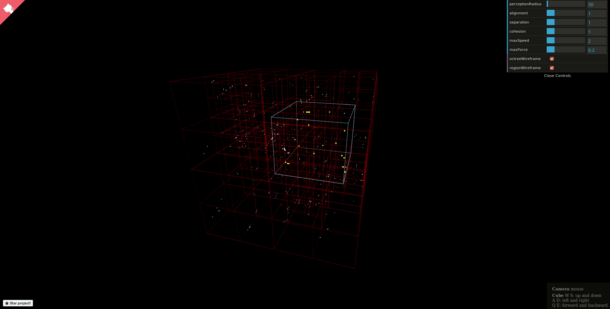

# [3D Spatial Partitioning](http://nickvanurk.com/boids-octree-simulation/)

This project demonstrates spatial partitioning through a 3D visualization of the [Boids](https://en.wikipedia.org/wiki/Boids) flocking algorithm using an octree.

## Motivation

While developing my [3D browser shooter](https://github.com/nickyvanurk/3d-multiplayer-browser-shooter), I was dissatisfied with the way bullet and ship collisions were handled. This led me to explore more efficient solutions, which brought me to **spatial partitioning**.

Instead of performing collision checks between every bullet and ship (O(n^2) complexity), spatial partitioning divides the world into partitions using an octree. Each node in the octree represents a 3D space that can contain a maximum number of entities. When this limit is exceeded, the space is subdivided into eight smaller spaces, and this process continues recursively.

With this method, collision checks are significantly optimized. For each bullet, the octree can be queried to find ships within the same space (node), reducing the complexity to O(log n) and making the process much more efficient when handling numerous entities.

## License

This project is licensed under the [MIT License](./LICENSE).
