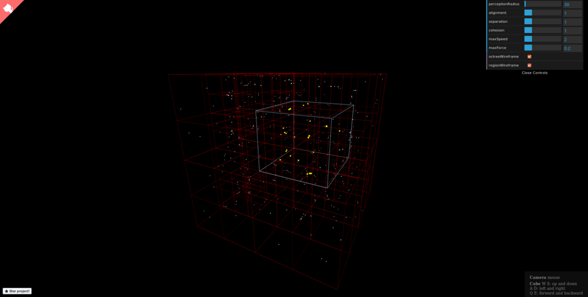

# [3D Boids Octree Simulation](http://nickyvanurk.com/boids-octree-simulation/)

A 3D boids simulation optimised by using a quadtree, the 3d rendering has been done with three.js.

## License

This project is licensed under the [MIT License](./LICENSE).
